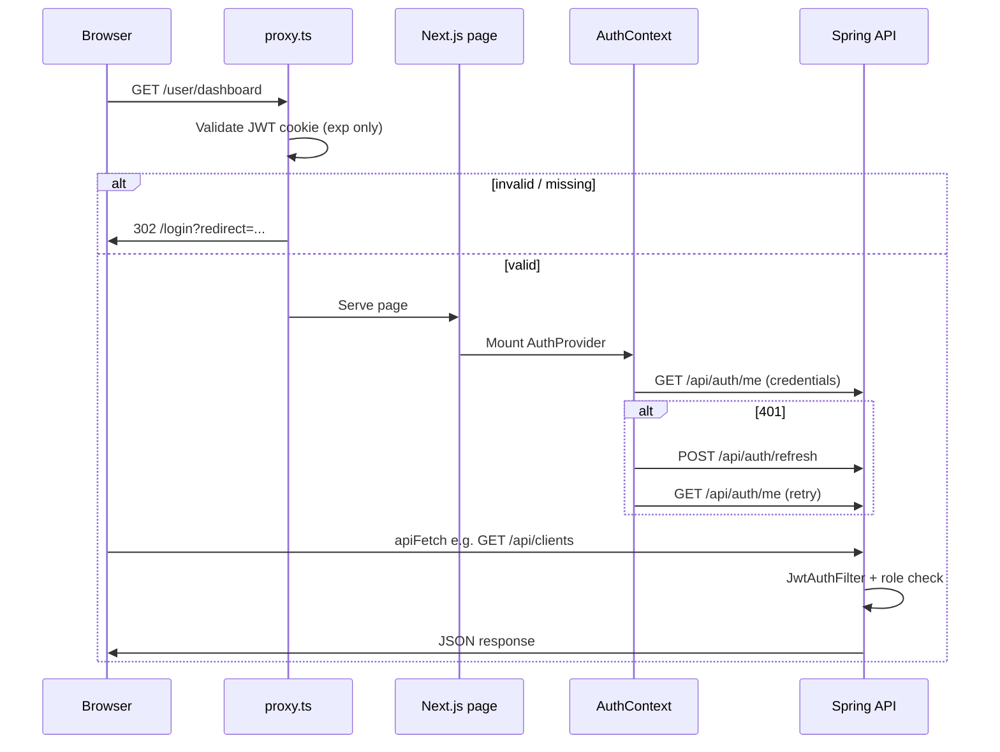

# ESGSaathi — API Architecture

This document describes how APIs are structured across the **Next.js UI** (`esg-saathi-ui`) and the **Spring Boot backend** (`saathi`). It covers authentication, endpoint contracts, client libraries, BFF routes, and external integrations.

---

## 1. System topology

```
┌─────────────────────────────────────────────────────────────────────────────┐
│  Browser                                                                     │
└─────────────────────────────────────────────────────────────────────────────┘
         │                                    │
         │ same-origin                        │ cross-origin (credentials)
         ▼                                    ▼
┌─────────────────────────┐      ┌──────────────────────────────────────────┐
│  Next.js (port 3000)     │      │  Spring Boot API (port 8080)              │
│  ─────────────────────   │      │  ───────────────────────────────────────  │
│  proxy.ts                │      │  SecurityConfig + JwtAuthFilter           │
│  app/api/* (BFF)         │      │  Controllers under /api/*                 │
│  modules/*/api/* (clients)│     │  Redis (JWT blacklist, user cache)        │
└─────────────────────────┘      └──────────────────────────────────────────┘
         │                                    │
         │ Supabase                           │ PostgreSQL, email, Gemini
         ▼                                    ▼
┌─────────────────────────┐      ┌──────────────────────────────────────────┐
│  Supabase               │      │  Sanity CMS (blog — read-only from UI)     │
│  contact, waitlist      │      │  api.postalpincode.in (pincode lookup)    │
└─────────────────────────┘      └──────────────────────────────────────────┘
```

| Layer | Base URL | Role |
|-------|----------|------|
| Spring API | `NEXT_PUBLIC_API_URL` (default `http://localhost:8080`) | Product backend — auth, profiles, assessments, admin |
| Next.js BFF | Same origin as UI (`/api/...`) | Public forms, pincode proxy, legacy Supabase admin bridge |
| Sanity | `*.apicdn.sanity.io` / `*.api.sanity.io` | Blog content (GROQ) |
| Supabase | Server-side only | Contact + waitlist persistence |

---

## 2. Authentication architecture

### 2.1 Session model

- **Stateless JWT** stored in an **HttpOnly cookie** (not in `localStorage`).
- Spring `SessionCreationPolicy.STATELESS` — no server-side HTTP sessions.
- UI sends `credentials: "include"` on every API call so the cookie is attached cross-origin.

### 2.2 Cookie names

| Environment | Cookie name | Set by |
|-------------|-------------|--------|
| Production (`cookie.secure: true`) | `__Host-sid` | `CookieUtil` |
| Local HTTP (`cookie.secure: false`) | `token` | `CookieUtil` (legacy name for localhost) |

The UI and `proxy.ts` accept **both** names during migration (`modules/platform/auth/cookies.ts`).

`JwtAuthFilter` resolves the token from:

1. `Authorization: Bearer <jwt>` header, or
2. `__Host-sid` or `token` cookie

### 2.3 JWT lifecycle

```
Login / verify-otp / verify-registration / reset-password
    → Spring sets HttpOnly cookie (Set-Cookie)
    → AuthResponse.token is @JsonIgnore — never in JSON body

Every authenticated request
    → JwtAuthFilter validates signature, expiry, fingerprint, Redis blacklist
    → User loaded (Redis cache 5 min) → SecurityContext

401 (expired / invalid)
    → UI: POST /api/auth/refresh (once) → retry original request
    → Still 401 → redirect /login?reauth=1

Logout
    → POST /api/auth/logout → blacklist JTI + delete cookie
    → UI → /login?signed_out=1
```

### 2.4 `/api/auth/me` contract

Flat shape (not nested `user`):

```json
{
  "authenticated": true,
  "id": "uuid",
  "email": "user@example.com",
  "name": "First Last",
  "role": "MSME"
}
```

Unauthenticated → **401** with `{ "authenticated": false }`.

### 2.5 Route guard layers

| Layer | File | Behavior |
|-------|------|----------|
| Edge proxy | `proxy.ts` | JWT decode on cookie; blocks `/user/*`, `/admin` without valid token |
| Client session | `AuthContext.tsx` | `GET /api/auth/me`; proactive `POST /api/auth/refresh` every 5 min |
| API | `SecurityConfig.java` | Spring Security + `@PreAuthorize` per controller |
| Dashboard RBAC | `dashboard/nav/dashboardNav.ts` | Role-based nav and view visibility |

**Important:** `/login` is never auto-redirected by `proxy.ts`. The client verifies the session via `/me` because a locally decodable JWT may still be revoked server-side.

### 2.6 Status code semantics (UI)

| Code | Meaning | UI handling |
|------|---------|-------------|
| **401** | Session invalid / expired | Refresh once; then redirect to `/login?reauth=1` |
| **403** | Authenticated but forbidden (wrong role) | Returned to caller — **no** logout redirect |
| **204** | No content (e.g. no Lighthouse report) | Treated as empty/`null` |
| **429** | Rate limit | User-facing “wait and try again” message |

Lighthouse `GET /api/lighthouse/me` uses `redirectOnFailure: false` so MSME users without a report (or wrong role → 403) do not trigger a login loop.

---

## 3. UI HTTP client stack

All Spring calls go through the platform layer.

```
Feature module (e.g. clientsApi.ts)
        │
        ▼
apiFetch()          modules/platform/api/client.ts
        │
        ▼
fetchWithSession()  modules/platform/api/sessionFetch.ts
        │
        ├── credentials: "include"
        ├── 401 → POST /api/auth/refresh → retry
        └── 401 after refresh → redirectToLogin()
```

| Export | Path | Purpose |
|--------|------|---------|
| `API_URL` | `modules/platform/api/constants.ts` | `NEXT_PUBLIC_API_URL` |
| `fetchWithSession` | `modules/platform/api/sessionFetch.ts` | Low-level cookie fetch + refresh |
| `apiFetch` | `modules/platform/api/client.ts` | JSON parse, error extraction, 204 handling |
| `clearServerSession` | `modules/platform/api/sessionFetch.ts` | `POST /api/auth/logout` |

### 3.1 UI API client modules

| UI module | Client file | Spring base path |
|-----------|-------------|------------------|
| platform/auth | `AuthContext.tsx`, `sessionFetch.ts` | `/api/auth/*` |
| auth-ui | `auth-ui/components/shared/api.ts` | `/api/auth/*` (re-exports `apiFetch`) |
| account | `account/api/accountApi.ts` | `/api/account/*` |
| account/profile | `account/profile/Details.tsx` | `/api/profile/*` |
| lighthouse | `lighthouse/api/lighthouseApi.ts` | `/api/lighthouse/*` |
| brsr | `brsr/api/brsrApi.ts` | `/api/brsr/*` |
| clients | `clients/api/clientsApi.ts` | `/api/clients/*` |
| ai-advisor | `ai-advisor/api/aiAdvisorApi.ts` | `/api/ai-advisor/*` |
| admin | `admin/api/adminApi.ts` | `/api/admin/*` |

### 3.2 Client-side caches (sessionStorage)

| Cache key / module | Data |
|--------------------|------|
| `auth_user` | Current user from `/me` |
| `profile_data_{role}` | Role profile GET response |
| `account_settings` | Account settings |
| `lighthouse_report` | Latest Lighthouse JSON for export |
| `brsr_assessments` | BRSR list per session |
| `admin_*` caches | Analytics, users, contact inbox |

Caches are hints only; authoritative state always comes from the API.

---

## 4. Spring Boot API — endpoint reference

**Base:** `{API_URL}/api`  
**Default local:** `http://localhost:8080/api`

Roles: `MSME`, `CA`, `CS`, `ESG_CONSULTANT`, `ASSURER_AUDITOR`, `ADMIN`

### 4.1 Auth — `/api/auth`

Controller: `AuthController`, `AuthCheckController`

| Method | Path | Auth | Description |
|--------|------|------|-------------|
| POST | `/pre-register` | Public | Start registration; sends OTP |
| POST | `/verify-registration` | Public | Verify OTP; creates user; sets cookie |
| POST | `/login` | Public | Start OTP login |
| POST | `/verify-login` | Public | Verify OTP; sets cookie |
| POST | `/login-password` | Public | Email + password login; sets cookie |
| POST | `/logout` | Public* | Blacklist JWT; clear cookie |
| POST | `/refresh` | Authenticated | Rotate JWT; new cookie |
| POST | `/resend-otp?email=&flow=` | Public | Resend OTP (`flow`: `login` \| `register`) |
| POST | `/forgot-password` | Public | Send reset OTP |
| POST | `/reset-password` | Public | Reset with OTP; sets cookie |
| GET | `/keepalive` | Public | Health ping (200 empty) |
| GET | `/me` | Authenticated | Current user summary |

\*Logout is permit-all so stale cookies can still be cleared.

**AuthResponse body** (login flows): `message`, `role`, `email`, `firstName`, `userId`, `verified`, `profileComplete` — **no `token` in JSON**.

### 4.2 Account — `/api/account`

Controller: `AccountController` — **authenticated**

| Method | Path | Body | Response |
|--------|------|------|----------|
| GET | `/` | — | `AccountSettingsResponse` |
| PATCH | `/phone` | `{ phoneNo }` | Updated settings |
| POST | `/email/send-otp` | `{ newEmail }` | `AuthResponse` message |
| POST | `/email/verify` | `{ newEmail, otp }` | New cookie on success |
| POST | `/password/send-otp` | — | OTP to current email |
| POST | `/password/change` | `{ otp, newPassword }` | New cookie on success |

### 4.3 Profile — `/api/profile`

Controller: `ProfileController` — **authenticated + role**

Each role has `GET` (read) and `POST` (complete/update profile).

| Role | Path prefix |
|------|-------------|
| MSME | `/msme` |
| CA | `/ca` |
| CS | `/cs` |
| ESG Consultant | `/esg-consultant` |
| Assurer / Auditor | `/assurer-auditor` |

Example: `GET /api/profile/msme` — `@PreAuthorize("hasRole('MSME')")`

### 4.4 Lighthouse (MSME) — `/api/lighthouse`

Controller: `LighthouseAssessmentController` — **`hasRole('MSME')`**

| Method | Path | Body | Response |
|--------|------|------|----------|
| GET | `/me` | — | `LighthouseAssessmentResponse` or **204** if none |
| POST | `/submit` | `{ answers: Record<kpiId, score>, sector? }` | **201** + full report JSON |

Report includes pillar breakdowns (`env`, `social`, `gov`), `esgStrength`, `esgScopeOfImprovement`.

### 4.5 BRSR (CA / CS / Consultant / Assurer) — `/api/brsr`

Controller: `BrsrAssessmentController` — **authenticated** (service enforces ownership)

| Method | Path | Body | Response |
|--------|------|------|----------|
| GET | `/` | — | `List<BrsrAssessmentResponse>` |
| POST | `/` | `{ clientId, fiscalYear }` | **201** create or resume |
| GET | `/{assessmentId}` | — | Single assessment |

Assessment fields: `id`, `clientId`, `clientCompanyName`, `fiscalYear`, `status`, `completionPct`, `eScore`, `sScore`, `gScore`, `totalScore`, timestamps.

### 4.6 Clients — `/api/clients`

Controller: `ClientController` — **authenticated**

| Method | Path | Query / body | Response |
|--------|------|--------------|----------|
| GET | `/` | `page`, `size` (max 100) | Spring `Page<ClientResponse>` |
| POST | `/` | `ClientRequest` | **201** `ClientResponse` |
| GET | `/{clientId}/assessments` | — | BRSR list for client |
| DELETE | `/{clientId}` | — | **204** soft delete |

### 4.7 AI Advisor — `/api/ai-advisor`

Controller: `AiAdvisorController` — **authenticated**

| Method | Path | Body | Response |
|--------|------|------|----------|
| GET | `/quota` | — | `{ used, limit, remaining }` |
| POST | `/chat` | `{ message, history[] }` | `{ reply, questionsUsed, questionsRemaining, dailyLimit }` |

### 4.8 Admin — `/api/admin`

Controllers: `DashboardController`, `AdminUserController` — **`hasRole('ADMIN')`**

| Method | Path | Description |
|--------|------|-------------|
| GET | `/contact-info?page=&size=` | Unreplied contact messages (paginated) |
| GET | `/waitlist-info` | All waitlist emails |
| POST | `/reply` | `{ contactId, to, subject, message }` — email reply + mark replied |
| POST | `/send-waitlist-update` | `{ subject, message }` — broadcast to waitlist |
| GET | `/users/analytics` | User counts by role, active/inactive |
| GET | `/users?role=&page=&size=` | Paginated users for role |

---

## 5. Security configuration (Spring)

From `SecurityConfig.java`:

| Pattern | Access |
|---------|--------|
| `/api/auth/pre-register`, `login`, `verify-*`, `logout`, `resend-otp`, `forgot-password`, `reset-password`, `keepalive`, `login-password` | `permitAll` |
| `/api/auth/me`, `/api/auth/refresh` | `authenticated` |
| `/api/profile/**`, `/api/account/**` | `authenticated` |
| `/api/admin/**` | `hasRole("ADMIN")` |
| All other `/api/**` | `authenticated` |

Filters (order): `RateLimitFilter` → `JwtAuthFilter` → Spring Security.

CORS: `allowed.origins` from config; `allowCredentials: true`; exposes `Set-Cookie`.

---

## 6. Role → feature matrix

| Feature | MSME | CA | CS | ESG_CONSULTANT | ASSURER_AUDITOR | ADMIN |
|---------|:----:|:--:|:--:|:--------------:|:---------------:|:-----:|
| Lighthouse assessment | ✓ | | | | | |
| BRSR assessments | | ✓ | ✓ | ✓ | ✓ | |
| Client management | | ✓ | ✓ | ✓ | ✓ | |
| AI Advisor | ✓ | ✓ | ✓ | ✓ | ✓ | |
| Account settings | ✓ | ✓ | ✓ | ✓ | ✓ | ✓ |
| Role profile | ✓ | ✓ | ✓ | ✓ | ✓ | |
| Admin inbox / users | | | | | | ✓ |

UI routing: `AssessmentView` sends MSME → Lighthouse; all other professional roles → BRSR.

---

## 7. Next.js BFF routes (`app/api`)

These run on the **Next.js server**, not Spring.

| Method | Path | Auth | Backend | Purpose |
|--------|------|------|---------|---------|
| POST | `/api/database/contact` | Public | Supabase `contact` table | Public contact form |
| POST | `/api/database/waitlist` | Public | Supabase `waitlist` + email | Marketing waitlist |
| GET | `/api/contact/unreplied` | JWT + ADMIN in Supabase | Spring `/me` + Supabase | Legacy unreplied contacts (admin) |
| GET | `/api/pincode?pin=` | Public | `api.postalpincode.in` | Pincode → city/state lookup |

---

## 8. External APIs (no Spring)

### 8.1 Sanity CMS (blog)

- Module: `modules/blog/sanity.ts`
- Env: `NEXT_PUBLIC_SANITY_PROJECT_ID`, `NEXT_PUBLIC_SANITY_DATASET`
- `fetchSanity()` — CDN first, API fallback, `revalidate: 300`
- GROQ queries filter `defined(slug.current)` for publishable posts

### 8.2 Postal pincode

- Proxied via `app/api/pincode/route.ts` to avoid browser CORS issues

---

## 9. Error handling conventions

### Spring

- Validation errors → 400 with `{ errors: { field: "message" } }` or `{ message }`
- Unauthorized → 401
- Wrong role → 403
- Not found → 404
- Rate limit → 429 (via `RateLimitFilter`)

### UI (`apiFetch`)

- Parses `errors` map into a single thrown `Error` string
- 429 → friendly rate-limit message
- Other failures → `message` or `Request failed (status)`

---

## 10. Environment variables

| Variable | Used by | Purpose |
|----------|---------|---------|
| `NEXT_PUBLIC_API_URL` | UI clients, BFF | Spring base URL |
| `NEXT_PUBLIC_SANITY_PROJECT_ID` | Blog | Sanity project |
| `NEXT_PUBLIC_SANITY_DATASET` | Blog | Sanity dataset (default `production`) |
| Supabase URL + service key | `platform/infra/supabaseServer` | Contact/waitlist BFF |
| `allowed.origins` | Spring CORS | Comma-separated UI origins |
| `cookie.secure` | Spring `CookieUtil` | `true` → `__Host-sid`; `false` → `token` |
| `security.require-https` | Spring | Force HTTPS channel |

---

## 11. Request flow (authenticated dashboard action)



---

## 12. Backend package layout (current vs target)

**Current (`saathi`):** controllers under `com.esg.saathi.controller` with services/repositories.

**Target** (aligned with UI `modules/`):

```
com.esgsaathi.saathi/
├── platform/          config, auth filter, web exceptions
└── modules/
    ├── account/
    ├── lighthouse/
    ├── brsr/
    ├── clients/
    ├── aiadvisor/
    ├── admin/
    └── profile/       msme, ca, cs, esg, assurer
```

See [ARCHITECTURE.md](./ARCHITECTURE.md) for the full enterprise module map and migration checklist.

---

## 13. Adding a new API surface

1. **Backend:** Add controller under the correct bounded context; set `@PreAuthorize`; add DTOs in `dto/`.
2. **UI:** Add `modules/{domain}/api/{domain}Api.ts` using `apiFetch`.
3. **RBAC:** Update `dashboardNav.ts` and `viewRegistry.tsx` if user-facing.
4. **Security:** Register path rules in `SecurityConfig` if not covered by `authenticated()`.
5. **Docs:** Extend the endpoint table in this file.

---

*Last aligned with: `esg-saathi-ui` (`proxy.ts`, `modules/platform/api/*`) and `saathi` controllers as of June 2026.*
